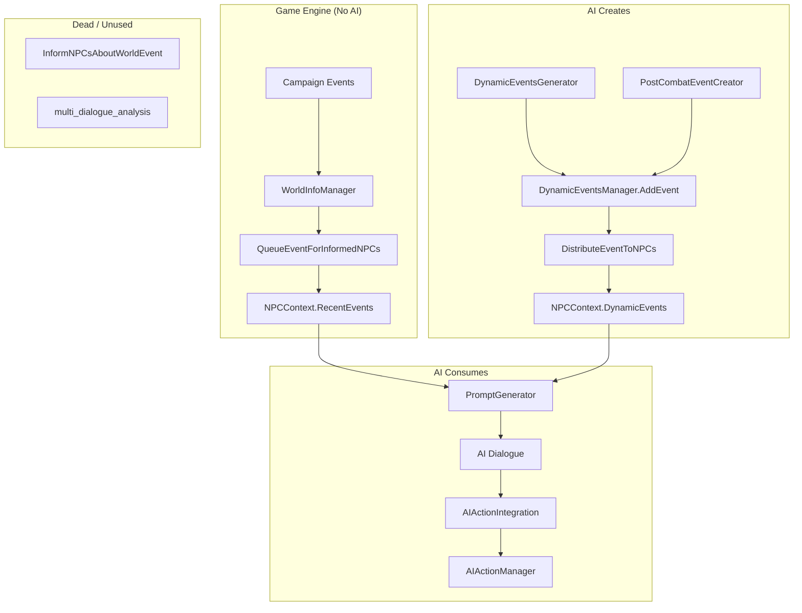
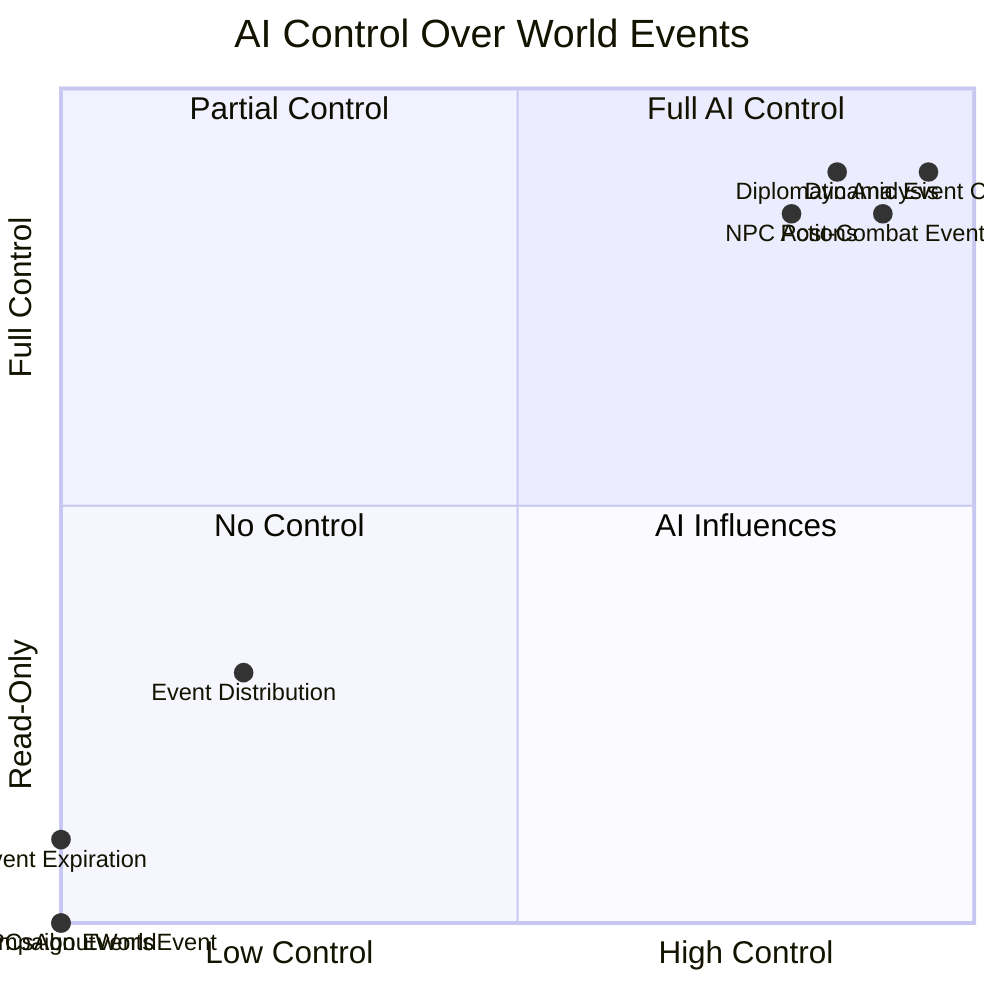
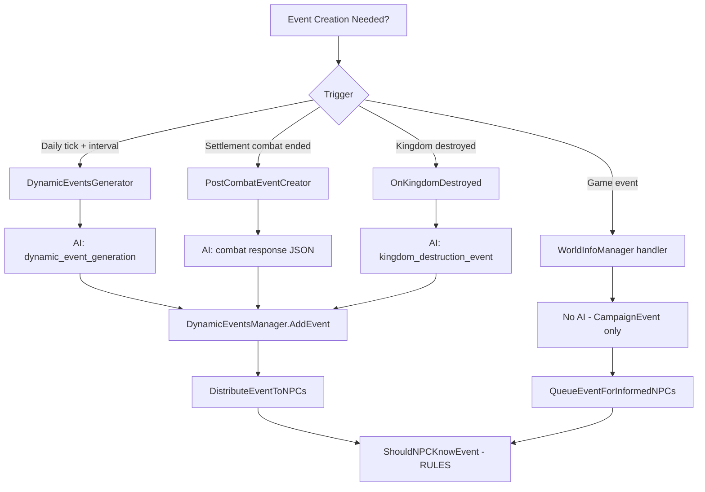

# AI Capabilities Mapping — World Events & Control

Exhaustive mapping of AI capabilities with respect to world events, event systems, and control flow. Identifies fragility points where the AI has limited or no control.

---

## 1. Executive Summary

| Dimension | AI Control | Notes |
|-----------|------------|-------|
| **Create dynamic events** | ✅ Full | AI generates content (scheduled, post-combat, kingdom destruction) |
| **Create campaign events** | ❌ None | Game engine only; AI cannot inject |
| **Distribute events to NPCs** | ❌ None | Fixed rules (`ShouldNPCKnowEvent`), not AI-driven |
| **Expire events** | ❌ None | Config lifespan only |
| **Trigger world events from dialogue** | ❌ None | `InformNPCsAboutWorldEvent` exists but is **never called** |
| **Execute NPC actions** | ✅ Via `technical_action` | 11 actions; AI outputs in dialogue JSON |
| **Diplomatic analysis** | ✅ Full | AI analyzes events, generates kingdom statements |
| **Combat narrative** | ✅ Full | AI generates settlement combat narrative + post-combat event |

---

## 2. Event Systems Overview

There are **two distinct event systems** that feed into NPC knowledge:

```
┌─────────────────────────────────────────────────────────────────────────────────┐
│                         EVENT SYSTEMS ARCHITECTURE                                │
├─────────────────────────────────────────────────────────────────────────────────┤
│                                                                                  │
│  ┌──────────────────────────────┐     ┌──────────────────────────────────────┐  │
│  │   CAMPAIGN EVENTS            │     │   DYNAMIC EVENTS                     │  │
│  │   (CampaignEvent)            │     │   (DynamicEvent)                      │  │
│  ├──────────────────────────────┤     ├──────────────────────────────────────┤  │
│  │ • Type: Battle, HeroKilled,  │     │ • AI-generated world events          │  │
│  │   Marriage, WarDeclared,     │     │ • Types: military, political,        │  │
│  │   Tournament, SettlementCap, │     │   economic, social, disease_outbreak  │  │
│  │   KingdomDecision, Prisoner  │     │ • Stored: dynamic_events.json        │  │
│  │ • Source: Game engine ONLY   │     │ • Source: AI (scheduled, combat,     │  │
│  │ • Storage: NPCContext.       │     │   kingdom destruction)               │  │
│  │   RecentEvents               │     │ • Storage: NPCContext.DynamicEvents   │  │
│  │                              │     │   (event IDs only)                   │  │
│  └──────────────────────────────┘     └──────────────────────────────────────┘  │
│                    │                                      │                       │
│                    └──────────────────┬───────────────────┘                       │
│                                       ▼                                           │
│                    ┌──────────────────────────────────────┐                       │
│                    │         PromptGenerator              │                       │
│                    │  Merges both into NPC dialogue ctx   │                       │
│                    └──────────────────────────────────────┘                       │
│                                       │                                           │
│                                       ▼                                           │
│                    ┌──────────────────────────────────────┐                       │
│                    │         AI Dialogue Response          │                       │
│                    └──────────────────────────────────────┘                       │
└─────────────────────────────────────────────────────────────────────────────────┘
```

---

## 3. Campaign Events — AI Has Zero Control

Campaign events are **purely game-triggered**. The AI cannot create, modify, or inject them.

### 3.1 Campaign Event Types

| Type | Handler | File:Line |
|------|---------|-----------|
| WarDeclared | OnWarDeclared | WorldInfoManager.cs:2977 |
| TournamentFinished | OnTournamentFinished | WorldInfoManager.cs:3178 |
| SettlementOwnerChanged | OnSettlementOwnerChanged | WorldInfoManager.cs:3268 |
| KingdomDecisionConcluded | OnKingdomDecisionConcluded | WorldInfoManager.cs:3666 |
| Battle (MapEventStarted/Ended) | OnBattleStarted/OnBattleEnded | WorldInfoManager.cs:3670, 4056 |
| HeroKilled | OnHeroKilled | WorldInfoManager.cs:4067 |
| Marriage | OnHeroesMarried | WorldInfoManager.cs:4454 |
| PrisonerTaken | OnHeroPrisonerTaken | AIInfluenceBehavior.cs:8345 |
| PrisonerReleased | OnHeroPrisonerReleased | AIInfluenceBehavior.cs:8574 |
| KingdomLeadership | RulingClanChanged | AIInfluenceBehavior.cs:4911 |
| **WorldEvent** | InformNPCsAboutWorldEvent | WorldInfoManager.cs:6059 |

### 3.2 Dead API: `InformNPCsAboutWorldEvent`

```csharp
// WorldInfoManager.cs:6059
public void InformNPCsAboutWorldEvent(string eventTitle, string eventDescription, 
    Settlement eventLocation = null, List<string> involvedFactions = null)
```

**Finding:** This is the **only** API that would allow external/AI-triggered campaign events. It is **never called** anywhere in the codebase. No mod code, no AI flow, no hooks.

---

## 4. Dynamic Events — AI Control Points

### 4.1 Creation Triggers

```
┌─────────────────────────────────────────────────────────────────────────────────┐
│                    DYNAMIC EVENT CREATION FLOW                                     │
├─────────────────────────────────────────────────────────────────────────────────┤
│                                                                                  │
│  TRIGGER 1: Scheduled (Daily Tick)                                               │
│  ┌─────────────────┐    ┌─────────────────────┐    ┌─────────────────────────┐  │
│  │ AIInfluenceBeh. │───▶│ DynamicEventsMgr.   │───▶│ DynamicEventsGenerator  │  │
│  │ OnDailyTick()   │    │ OnDailyTick()       │    │ GenerateEvents()        │  │
│  └─────────────────┘    └─────────────────────┘    └───────────┬─────────────┘  │
│         │                            │                         │                 │
│         │                            │                         │ AI prompt:      │
│         │                            │                         │ world state +   │
│         │                            │                         │ dialogues +     │
│         │                            │                         │ existing events │
│         │                            │                         ▼                 │
│         │                            │              ┌─────────────────────────┐  │
│         │                            │              │ SendAIRequestWithBackend│  │
│         │                            │              │ "dynamic_event_generation"│  │
│         │                            │              └───────────┬─────────────┘  │
│         │                            │                          │                │
│  TRIGGER 2: Post-Combat                                              │                │
│  ┌─────────────────┐    ┌─────────────────────┐                    │                │
│  │ SettlementCombat │───▶│ PostCombatEventCreator│                   │                │
│  │ Manager         │    │ CreatePostCombatEvent │                   │                │
│  └─────────────────┘    └───────────┬──────────┘                   │                │
│         │                            │                              │                │
│         │                            │ AI combat response parsed    │                │
│         │                            │ as JSON → DynamicEvent       │                │
│         │                            │                              │                │
│  TRIGGER 3: Kingdom Destroyed        │                              │                │
│  ┌─────────────────┐    ┌─────────────────────┐                    │                │
│  │ KingdomDestroyed │───▶│ DynamicEventsGen.   │                    │                │
│  │ Event           │    │ OnKingdomDestroyed  │                    │                │
│  └─────────────────┘    └───────────┬─────────┘                    │                │
│                                     │                              │                │
│                                     │ SendAIRequestWithBackend     │                │
│                                     │ "kingdom_destruction_event"  │                │
│                                     │                              │                │
│                                     └──────────────┬───────────────┘                │
│                                                    ▼                                │
│                                     ┌─────────────────────────────┐                │
│                                     │ DynamicEventsManager.AddEvent│                │
│                                     └─────────────────────────────┘                │
└─────────────────────────────────────────────────────────────────────────────────┘
```

### 4.2 What AI Controls in Dynamic Events

| Field | AI Control | Used By |
|-------|------------|---------|
| Title, Description | ✅ Full | PromptGenerator, UI |
| Type | ✅ Full | Filtering, diplomacy |
| CharactersInvolved | ✅ Full | Distribution (direct/clan) |
| KingdomsInvolved | ✅ Full | Distribution, diplomacy |
| Importance | ✅ Full | Distribution (≥8 = all NPCs) |
| ApplicableNPCs | ✅ Full | Distribution filter |
| SettlementPenalty | ✅ Full | SettlementPenaltyManager |
| EconomicEffects | ✅ Full | EconomicEffectsManager |
| DiseaseData | ✅ Full | DiseaseManager |
| AllowsDiplomaticResponse | ✅ Full | DiplomacyManager |
| EventHistory (updates) | ✅ Via analysis | DynamicEventsAnalyzer |

### 4.3 What AI Does NOT Control

| Aspect | Control | Implementation |
|--------|---------|----------------|
| **Distribution rules** | ❌ None | `ShouldNPCKnowEvent()` — hardcoded logic |
| **Expiration** | ❌ None | `DynamicEventsLifespan` config |
| **When to generate** | ❌ None | `DynamicEventsInterval` config |
| **Max simultaneous** | ❌ None | `MaxSimultaneousDynamicEvents` config |
| **Which NPCs learn** | ❌ Indirect | AI sets CharactersInvolved/Importance; rules decide |

---

## 5. Event Distribution — Fixed Rules (No AI)

```
┌─────────────────────────────────────────────────────────────────────────────────┐
│              ShouldNPCKnowEvent() — DISTRIBUTION DECISION TREE                    │
│              (DynamicEventsManager.cs:416)                                         │
├─────────────────────────────────────────────────────────────────────────────────┤
│                                                                                  │
│  NPC knows event IF any of:                                                      │
│                                                                                  │
│  1. CharactersInvolved contains NPC.StringId                    → YES             │
│  2. CharactersInvolved contains NPC.Clan.Leader.StringId      → YES             │
│  3. Importance >= 8                                             → YES             │
│  4. KingdomsInvolved == "all" AND (no ApplicableNPCs OR         → YES             │
│     NPC matches ApplicableNPCs: lords, companions, etc.)                         │
│  5. NPC's Kingdom/Faction in KingdomsInvolved                  → YES             │
│  6. NPC's CurrentSettlement owner's kingdom in KingdomsInvolved → YES             │
│                                                                                  │
│  ELSE → NO                                                                       │
│                                                                                  │
│  AI can influence (1),(2),(3),(4),(5) via event fields — but cannot override       │
│  or add custom distribution logic.                                              │
└─────────────────────────────────────────────────────────────────────────────────┘
```

---

## 6. AI Request Types — Exhaustive List

| Request Type | File | Purpose |
|--------------|------|---------|
| `dynamic_event_generation` | DynamicEventsGenerator.cs:228, 289 | Create events from world state + dialogues |
| `dynamic_events` | DynamicEventsGenerator.cs:1813 | Diplomatic event processing |
| `kingdom_destruction_event` | DynamicEventsGenerator.cs:4133 | Kingdom destroyed event |
| `diplomacy_statement` | KingdomStatementGenerator.cs:1817 | Kingdom ruler statement |
| `player_statement_analysis` | PlayerStatementAnalyzer.cs:43 | Analyze player diplomatic statements |
| `history_gen` | DeathHistoryBehavior.cs:104 | Death history narrative |
| `npc_messenger` | NPCInitiativeSystem.cs:963 | NPC messenger response |
| `npc_letter_response` | NPCInitiativeSystem.cs:1525 | NPC letter reply |
| `npc_hostile_initiative` | NPCInitiativeSystem.cs:1967 | Hostile NPC approach |
| `npc_neutral_initiative` | NPCInitiativeSystem.cs:2183 | Neutral NPC approach |
| `multi_dialogue_analysis` | AIInfluenceBehavior.cs:213 | **Unused** — no caller passes this |
| (raw) | SettlementCombatManager.cs:581, 2326 | Combat prompts |
| (raw) | DynamicEventsAnalyzer.cs:1074 | Diplomatic analysis |

---

## 7. AI Actions — What NPCs Can Do

The AI controls NPC behavior via `technical_action` in the dialogue JSON response. Parsed by `AIActionIntegration`.

| Action | Class | Description |
|--------|-------|-------------|
| follow_player | FollowPlayerAction | Follow player on map |
| go_to_settlement | GoToSettlementAction | Travel to settlement (+ optional wait days) |
| return_to_player | ReturnToPlayerAction | Return to player |
| create_party | CreatePartyAction | Create temporary party |
| attack_party | AttackPartyAction | Attack party |
| siege_settlement | SiegeSettlementAction | Siege settlement |
| patrol_settlement | PatrolSettlementAction | Patrol around settlement |
| wait_near_settlement | WaitNearSettlementAction | Wait near settlement |
| raid_village | RaidVillageAction | Raid village |
| create_rp_item | CreateRPItemAction | Create RP item |
| transfer_troops_and_prisoners | TransferTroopsAndPrisonersAction | Transfer troops/prisoners |

**Flow:** AI outputs `technical_action: "action_name:params"` → `AIActionIntegration` parses → `AIActionManager.StartAction()` → Task system executes.

---

## 8. Campaign Event Subscriptions

```
┌─────────────────────────────────────────────────────────────────────────────────┐
│                    EVENT SUBSCRIPTION MAP                                         │
├─────────────────────────────────────────────────────────────────────────────────┤
│                                                                                  │
│  WorldInfoManager subscribes to:                                                 │
│  • WarDeclared, TournamentFinished, OnSettlementOwnerChangedEvent                 │
│  • KingdomDecisionConcluded, DailyTickEvent, HourlyTickEvent                    │
│  • MapEventStarted, MapEventEnded, OnPartyAddedToMapEvent                        │
│  • HeroKilledEvent                                                               │
│                                                                                  │
│  AIInfluenceBehavior subscribes to:                                              │
│  • OnSessionLaunchedEvent, TickEvent, DailyTickEvent, HourlyTickEvent           │
│  • RulingClanChanged, SettlementEntered, OnSettlementLeftEvent                    │
│  • OnMissionEndedEvent, MapEventStarted, MapEventEnded                            │
│  • HeroPrisonerTaken, HeroPrisonerReleased, MobilePartyDestroyed                 │
│  • HeroKilledEvent, NewCompanionAdded, OnPartyJoinedArmyEvent                    │
│  • OnClanChangedKingdomEvent, OnAgentJoinedConversationEvent                     │
│                                                                                  │
│  DiplomacyManager subscribes to:                                                 │
│  • WarDeclared, MakePeace, HourlyTickEvent, DailyTickEvent                       │
│  • MapEventStarted, MapEventEnded, OnPrisonerTakenEvent                          │
│  • HeroKilledEvent, OnSettlementOwnerChangedEvent, KingdomDestroyedEvent         │
│                                                                                  │
│  DynamicEventsGenerator subscribes to:                                           │
│  • KingdomDestroyedEvent                                                         │
│                                                                                  │
│  AIActionManager subscribes to:                                                  │
│  • SettlementEntered, OnSettlementLeft, OnHeroJoinedParty                         │
│  • MapEventStarted, MapEventEnded, OnMissionStartedEvent                         │
│  • HeroKilledEvent, HeroPrisonerTaken                                            │
│                                                                                  │
└─────────────────────────────────────────────────────────────────────────────────┘
```

---

## 9. Data Flow: Events → AI Prompt

```
┌─────────────────────────────────────────────────────────────────────────────────┐
│                    EVENTS → PROMPT FLOW                                           │
├─────────────────────────────────────────────────────────────────────────────────┤
│                                                                                  │
│  NPCContext.RecentEvents (CampaignEvent[])                                        │
│       │                                                                          │
│       │  Filter: PromptIncludeEvents, RecentEventsLifetimeDays                   │
│       │  Max 5 events, age ≤ config days                                         │
│       ▼                                                                          │
│  NPCContext.DynamicEvents (List<string> IDs)                                      │
│       │                                                                          │
│       │  DynamicEventsManager.GetEventsForNPC(npc)                               │
│       │  → Filter by ShouldNPCKnowEvent, !IsExpired()                            │
│       │  → Take top 5 by Importance, DaysSinceCreation                            │
│       ▼                                                                          │
│  NPCContext.DialogueAnalysisEvents (CampaignEvent[])                             │
│       │                                                                          │
│       │  From diplomatic analysis; merged on NPC load                            │
│       │  Filter: PromptIncludeEvents                                             │
│       ▼                                                                          │
│  ┌─────────────────────────────────────────────────────────────────────────┐   │
│  │ PromptGenerator.BuildPrompt()                                             │   │
│  │ • "Recent world events: ..." (Campaign + DialogueAnalysis)                │   │
│  │ • "Dynamic events in the world: ..." (DynamicEvent descriptions)          │   │
│  └─────────────────────────────────────────────────────────────────────────┘   │
│       │                                                                          │
│       ▼                                                                          │
│  AI Dialogue Response (with optional technical_action)                           │
│                                                                                  │
└─────────────────────────────────────────────────────────────────────────────────┘
```

---

## 10. Fragility Summary — Where AI Lacks Control

| Gap | Impact | Possible Direction |
|-----|--------|--------------------|
| **No API to create campaign events from AI** | AI cannot inject "WorldEvent" type; `InformNPCsAboutWorldEvent` is dead | Wire AI → InformNPCsAboutWorldEvent or new API |
| **Distribution is rule-based** | AI cannot say "NPC X should know this" beyond setting fields | AI-driven distribution or override flag |
| **No dialogue→event extraction** | Player/NPC dialogue cannot create events in real time | DynamicEventsAnalyzer or similar on dialogue close |
| **multi_dialogue_analysis unused** | Dead code path | Remove or wire to dialogue extraction |
| **Expiration is config-only** | AI cannot extend/shorten event lifespan | AI-suggested lifespan field |
| **Scheduled generation timing fixed** | AI cannot request "generate event now" | Manual trigger or AI-initiated generation |
| **Campaign events are read-only** | AI sees them but cannot add | InformNPCsAboutWorldEvent or equivalent |

---

## 11. File Reference

| File | Role |
|------|------|
| `src/AIInfluence/CampaignEvent.cs` | Campaign event model |
| `src/AIInfluence/NPCContext.cs` | RecentEvents, DynamicEvents, DialogueAnalysisEvents |
| `src/AIInfluence/WorldInfoManager.cs` | Campaign event handlers, QueueEventForInformedNPCs, InformNPCsAboutWorldEvent |
| `src/AIInfluence.DynamicEvents/DynamicEvent.cs` | Dynamic event model |
| `src/AIInfluence.DynamicEvents/DynamicEventsManager.cs` | AddEvent, DistributeEventToNPCs, ShouldNPCKnowEvent, GetEventsForNPC |
| `src/AIInfluence.DynamicEvents/DynamicEventsGenerator.cs` | AI event generation (scheduled, kingdom destruction) |
| `src/AIInfluence.SettlementCombat/PostCombatEventCreator.cs` | Combat → DynamicEvent |
| `src/AIInfluence/PromptGenerator.cs` | Merges events into NPC prompt |
| `src/AIInfluence.Behaviors.AIActions/AIActionManager.cs` | Action execution |
| `src/AIInfluence.Behaviors.AIActions/AIActionIntegration.cs` | technical_action parsing |
| `src/AIInfluence/AIInfluenceBehavior.cs` | SendAIRequest, event subscriptions |

---

## 12. Mermaid Diagrams (for renderers that support Mermaid)

### 12.1 Overall AI Capabilities Flow



### 12.2 AI Control Matrix



### 12.3 Event Creation Decision Tree


